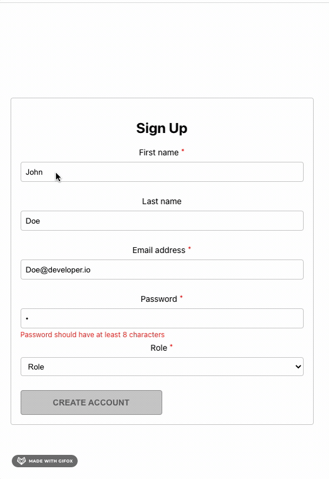

# Instructions

## Task

You've learned how to create controlled components and forms in React.
Now it's time to put that knowledge to use and create a registration form for Little Lemon Restaurant, where users are able to sign up.

The form layout and styling is already predefined for you. You have to add the missing pieces of code to make the form work as per the requirements.
The form is provided in an uncontrolled fashion and contains the following inputs:

- First Name
- Last Name
- Email
- Password
- Role

All the local state needed to complete this task has been already defined for you.

**Note:** Before you begin, make sure you understand how to work with the Coursera Code Lab for the [Advanced React course](https://www.coursera.org/learn/advanced-react/supplement/htaLX/working-with-labs-in-this-course).

## Outcome :

